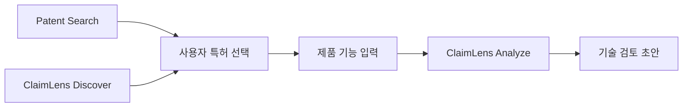
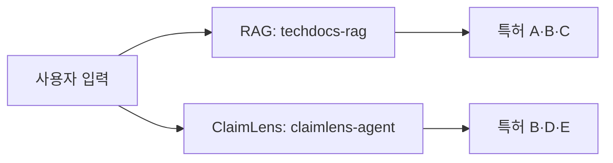
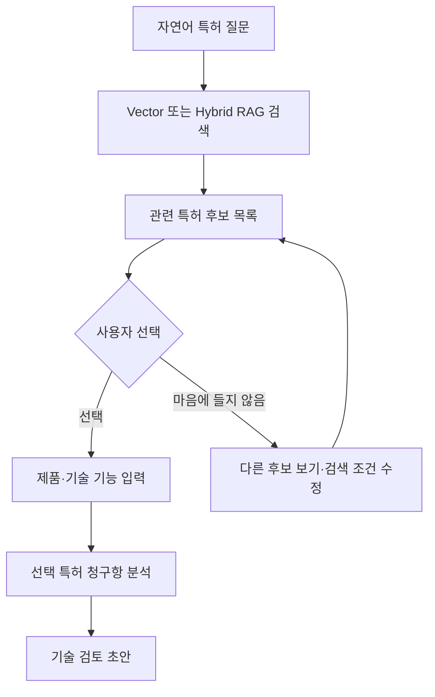
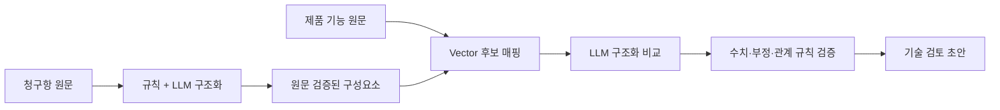

# ClaimLens 사용자 흐름과 청구항 비교 재설계

- 최종 수정일: 2026년 8월 12일
- 작성자: 심우현
- 상태: 구현 전 목표 설계
- 목적: 특허 검색과 청구항 비교의 경계를 명확히 하고, 실제 특허 청구항 표본 검증을 바탕으로 ClaimLens의 사용자 흐름과 분석 원칙을 정의합니다.

## 1. 재설계 결론

일반 RAG 검색은 관련 특허를 발견하는 기능으로 유지합니다. ClaimLens는 사용자가 선택한 특허를 상세 비교하는 흐름을 기본으로 하고, 특정 특허를 모르는 사용자를 위한 후보 탐색을 보조 흐름으로 둡니다.



각 기능의 책임은 다음과 같습니다.

| 기능 | 책임 | 결과 |
| --- | --- | --- |
| Patent Search | 자연어 질문으로 관련 특허 문서 검색 | 특허 후보와 근거 문서 |
| ClaimLens Discover | 제품 설명으로 분석 후보 특허 탐색 | 사용자가 선택할 후보 목록 |
| ClaimLens Analyze | 선택한 특허의 청구항과 제품 기능 비교 | 원문 근거가 있는 기술 검토 초안 |
| Workflow Orchestrator | 검색 품질 확인, 자동 수집, 색인 및 재검색 순서 관리 | 중단되지 않는 검색 흐름 |

Agent는 별도의 검색 알고리즘이 아니라 검색, 데이터 보충, 재검색 및 결과 생성의 순서를 관리하는 역할로 정의합니다.

## 2. 현재 구현의 문제

현재 RAG와 ClaimLens는 제품 설명을 기준으로 각각 별도의 후보를 검색합니다.



이 구조에는 다음 문제가 있습니다.

- RAG에서 사용자가 확인한 특허가 ClaimLens 분석 대상으로 그대로 전달되지 않습니다.
- 특정 특허를 분석하고 싶어도 ClaimLens가 다른 후보를 다시 검색할 수 있습니다.
- ClaimLens 후보는 Vector로 찾지만 최종 구성요소 비교는 형태 변화와 동의어에 취약한 단어 일치에 의존합니다.
- 종속항이 참조하는 부모 청구항 번호를 파싱하지만 DB에 보존하지 않습니다.
- 종속항 자체 문장만 비교하면 부모 청구항에서 상속한 모든 조건을 놓칩니다.
- 파싱 품질 점수와 상태를 기록하지만 재처리, 제외 또는 사람 검수에 연결하지 않습니다.
- 화면의 `특허 침해 위험 분석`, `정밀 분석` 표현은 현재 기술 비교 수준보다 강합니다.

## 3. 실제 특허 청구항 표본 검증

2026년 8월 12일 기준 배터리, 자율주행, 무선통신, 의료영상, 반도체 및 로봇 분야의 공개 한국 특허 20건을 수집하여 현재 `claim_parser.py`로 244개 청구항을 분석했습니다.

대표 표본은 다음과 같습니다.

- [KR102905731B1 가스 배출 구조를 구비한 배터리 셀](https://patents.google.com/patent/KR102905731B1/ko)
- [KR20130091907A 차량의 자율주행 장치 및 그 방법](https://patents.google.com/patent/KR20130091907A/ko)
- [KR102132564B1 진단 장치 및 진단 방법](https://patents.google.com/patent/KR102132564B1/ko)
- [KR20100012833A 반도체 제조 장치의 세정 장치 및 세정 방법](https://patents.google.com/patent/KR20100012833A/ko)
- [KR102739802B1 로봇 및 이의 제어 방법](https://patents.google.com/patent/KR102739802B1/ko)

### 표본 결과

| 항목 | 결과 |
| --- | ---: |
| 전체 특허 | 20건 |
| 전체 청구항 | 244개 |
| 독립항 | 35개 |
| 종속항 | 186개 |
| 삭제항 | 23개 |
| 표본의 독립항·종속항·삭제항 분류 불일치 | 0개 |
| `uncertain`으로 처리된 활성 청구항 | 221개 중 172개, 77.8% |
| 단일 구성요소로 남은 종속항 | 186개 중 159개, 85.5% |

표준적인 `제1항에 있어서`, `청구항 1에 있어서` 표현을 이용한 독립항·종속항 판정은 이 표본에서 안정적으로 동작했습니다. 반면 종속항의 추가 한정과 긴 독립항을 의미 있는 구성요소로 나누는 품질은 충분하지 않았습니다.

현재 단어 비교기도 실제 청구항 문구와 의미가 같은 자연어 제품 설명을 비교하는 실험에서 다음과 같은 결과를 냈습니다.

| 청구항 표현 | 제품 표현 | 현재 결과 |
| --- | --- | --- |
| 차량의 현재 위치를 획득 | 자동차의 GPS 좌표를 받아옴 | `not_found` |
| 배터리에서 발생한 가스를 외부로 배출 | 전지에서 생긴 기체를 케이스 밖으로 내보냄 | `not_found` |
| 의료 영상의 두 물체를 구분 | CT 이미지의 두 조직을 식별 | `not_found` |
| 배터리 열폭주 감지 가스 배출 | 배터리 열폭주를 감지해 가스를 배출 | `uncertain` |

마지막 사례처럼 핵심 명사가 눈에 보이게 겹쳐도 조사와 어미가 붙으면 일치 점수가 크게 낮아졌습니다. 따라서 단어 일치를 최종 비교 기준으로 유지하기 어렵습니다.

이 검증은 20개 공개 특허 표본에 대한 현재 구현 진단이며 전체 특허 형식에 대한 정확도 보장을 의미하지 않습니다. 구현 전에는 분야와 문서 형식을 확대한 고정 평가 데이터셋이 필요합니다.

## 4. 목표 사용자 여정

### 4.1 기본 흐름: 검색 후 특정 특허 분석



RAG 결과 카드에는 `이 특허 청구항 비교` 행동을 제공합니다. 사용자가 선택한 `application_number`를 ClaimLens Analyze에 전달하며, Analyze는 다른 특허를 다시 검색하지 않습니다.

후보가 마음에 들지 않을 때 다음 행동을 제공합니다.

- 다른 후보 보기
- 현재 특허 제외
- 검색 조건 수정
- 제외 이유 선택: 기술 분야 불일치, 출원인 불일치, 기간 불일치, 관련성 부족
- 남은 후보 재정렬
- 후보가 부족하면 검색 범위를 넓히거나 KIPRIS 추가 수집

제외한 특허 번호와 검색 조건은 현재 브라우저 검색 세션에서만 유지합니다. 분석 내용을 영구 저장하지 않습니다.

### 4.2 보조 흐름: 제품 설명으로 후보 탐색

사용자가 분석할 특허를 모르는 경우 ClaimLens Discover를 사용합니다.

```text
제품 설명 입력
→ 관련 특허·독립항 후보 Vector 검색
→ 후보 관련 이유와 핵심 청구항 표시
→ 사용자가 특정 특허 선택
→ ClaimLens Analyze 실행
```

Discover는 분석 결과를 자동 확정하는 기능이 아니라 분석할 후보를 선택하도록 돕는 기능입니다. 한 번에 다수 특허의 상세 비교 보고서를 생성하지 않습니다.

### 4.3 제품 설명 입력 구조

자유 문장만 받으면 제품 근거가 부족할 수 있으므로 다음 항목을 선택적으로 안내합니다.

- 제품 또는 시스템의 목적
- 입력 데이터와 입력 방식
- 주요 구성 장치 또는 모듈
- 처리 순서와 판단 조건
- 출력 또는 제어 결과
- 수치 범위, 재료, 연결 관계 등 구체 조건

각 입력 내용은 최종 비교표에서 제품 근거 원문으로 그대로 인용합니다.

## 5. 청구항 구조화 원칙

특허에는 여러 독립항과 종속항이 있을 수 있습니다. 독립항은 별도 하위 테이블이 아니라 다른 청구항을 참조하지 않는 청구항의 종류입니다.

종속항은 참조하는 부모 청구항의 모든 한정을 포함하고 추가 조건을 부가합니다. [WIPO PCT Rule 6.4](https://www.wipo.int/en/web/pct-system/texts/rules/r6)는 종속항이 참조한 청구항의 모든 한정을 포함하는 것으로 해석하도록 설명합니다.

```text
제1항: A + B + C
제2항: 제1항 + D
제3항: 제2항 + E

제1항 유효 구성: A + B + C
제2항 유효 구성: A + B + C + D
제3항 유효 구성: A + B + C + D + E
```

ClaimLens는 다음 순서로 처리합니다.

1. 삭제 또는 포기된 청구항을 분석 대상에서 제외합니다.
2. 각 청구항의 직접 참조 번호를 추출합니다.
3. 독립항과 종속항의 참조 트리를 구성합니다.
4. 독립항의 구성요소를 먼저 비교합니다.
5. 종속항은 모든 부모 요소와 자신이 추가한 요소를 합쳐 비교합니다.
6. 복수 종속항은 가능한 참조 경로를 각각 분리합니다.
7. 순환 참조, 존재하지 않는 참조 및 파싱 실패는 자동 추정하지 않고 오류 또는 검토 필요 상태로 둡니다.
8. 모든 구조화 요소는 청구항 원문의 대응 문자열을 가져야 합니다.

DB에는 최소한 다음 정보가 필요합니다.

```text
claim_dependencies
- claim_id
- referenced_claim_id

claims
- parser_method
- parser_version

claim_elements
- source_text 또는 source_start/source_end
- element_order
```

관계 변경 전에는 실제 운영 PostgreSQL 감사와 Alembic baseline을 먼저 수행합니다.

## 6. 비교 엔진 설계

단어, Vector 및 LLM 중 하나에 최종 판단을 전부 맡기지 않습니다.



### 단계별 책임

| 단계 | 방식 | 책임 |
| --- | --- | --- |
| 번호·참조·삭제항 판정 | 결정론적 규칙 | 청구항 트리 생성 |
| 구성요소 분리 | 규칙 우선, LLM 보조 | 비교 가능한 최소 한정 추출 |
| 원문 검증 | 결정론적 코드 | 생성한 요소가 실제 청구항 원문에 존재하는지 확인 |
| 제품 기능 후보 탐색 | Embedding Vector | 표현이 다른 의미상 대응 후보 검색 |
| 의미 비교 | 구조화 LLM 응답 | 대응 여부, 차이 및 불확실성 설명 |
| 수치·부정·순서·관계 확인 | 결정론적 코드 | 의미 유사도만으로 놓치기 쉬운 필수 조건 검증 |

Vector 점수만으로 `matched`를 확정하지 않습니다. LLM도 제품 설명과 청구항 원문에 없는 근거를 만들 수 없도록 다음 값을 구조화해 반환해야 합니다.

- `claim_element_source`: 청구항 원문 인용
- `product_evidence_source`: 제품 설명 원문 인용 또는 `null`
- `comparison`: `supported`, `partially_supported`, `not_supported`, `uncertain`
- `reason`: 두 원문 사이의 기술적 공통점과 차이
- `missing_conditions`: 제품 설명에서 확인되지 않은 수치·재료·연결·순서 조건

제품 설명에 직접 근거가 없으면 `not_supported` 또는 `uncertain`으로 처리합니다. 이 상태는 비침해 결론이 아니라 제공된 제품 설명에서 해당 조건을 확인하지 못했다는 의미입니다.

## 7. 결과 화면

결과 화면의 기본 단위는 특허 → 청구항 → 구성요소입니다.

```text
특허 KR...
└─ 제1항 독립항
   ├─ 구성요소 1: 청구항 원문 ↔ 제품 근거
   ├─ 구성요소 2: 청구항 원문 ↔ 제품 근거
   └─ 구성요소 3: 청구항 원문 ↔ 제품 근거
└─ 제2항 종속항
   ├─ 제1항에서 상속한 구성요소
   └─ 제2항이 추가한 구성요소
```

각 비교 행에는 다음 내용을 표시합니다.

| 표시 항목 | 내용 |
| --- | --- |
| 청구항 원문 | 비교 대상이 된 원문 문자열 |
| 제품 근거 | 사용자가 입력한 제품 설명의 대응 원문 |
| 기술 비교 상태 | 확인됨, 일부 유사, 확인 안 됨, 판단 보류 |
| 차이 | 누락된 수치, 재료, 처리 순서 및 연결 관계 |
| 분석 범위 | 독립항 요소 또는 종속항 추가 요소 |

페이지 제목은 `특허 청구항 기술 비교`, 결과 제목은 `기술 검토 초안`을 사용합니다. 다음 안내를 고정 표시합니다.

> 이 결과는 사용자가 제공한 제품 설명과 공개 특허 청구항을 기술적으로 비교한 초안이며, 법률적 침해 여부를 판단하지 않습니다.

현재 Frontend의 `특허 침해 위험 분석`, `침해 위험을 정밀 분석` 표현은 구현 단계에서 위 용어로 변경합니다.

## 8. 데이터 저장 원칙

사용자 분석 결과는 영구 저장하지 않습니다.

| 저장 | 저장하지 않음 |
| --- | --- |
| 수집한 공개 특허 기본 정보 | 사용자의 제품 설명 |
| 청구항 원문과 참조 관계 | 청구항 비교 결과 |
| 원문 검증된 구성요소 | 기술 검토 초안 |
| 검색과 분석을 위한 Vector | 구성요소별 LLM 판단 내용 |

분석 결과는 요청 중 생성해 SSE로 전달하고 요청 종료 후 폐기합니다. 운영 지표가 필요하면 사용자 입력과 분석 내용 없이 성공 여부, 단계별 소요시간 및 오류 코드만 집계합니다.

## 9. 목표 API 경계

구체적인 URL은 구현 시 기존 API 호환성을 검토한 뒤 확정하되 책임은 다음처럼 분리합니다.

```text
POST /api/search/stream
→ 일반 RAG 검색과 특허 후보 반환

POST /api/claimlens/discover/stream
→ 제품 설명으로 분석 후보 특허 탐색

POST /api/claimlens/patents/{application_number}/analyze/stream
→ 사용자가 선택한 특정 특허만 상세 분석
```

Analyze 요청은 제품 설명과 선택 특허 번호를 받고, 응답에는 분석한 특허 번호와 청구항 번호를 항상 포함합니다. 서버는 선택하지 않은 특허로 대상을 자동 변경하지 않습니다.

## 10. 구현 순서와 완료 기준

### 단계 1. 평가 기준 고정

- 다양한 분야와 형식의 공개 특허 청구항 fixture를 마련합니다.
- 독립항, 단일·복수 종속항, 삭제항, 긴 청구항 및 수치 한정 사례를 포함합니다.
- 제품 표현과 청구항 표현의 동의어·형태 변화 비교쌍을 작성합니다.

완료 기준: 파서와 비교 엔진 변경 전후 결과를 같은 fixture로 재현할 수 있습니다.

### 단계 2. 선택 특허 분석 경계 추가

- RAG 결과 카드에서 특정 특허를 선택합니다.
- `application_number`로 해당 특허와 청구항을 직접 조회합니다.
- ClaimLens가 다른 특허를 재검색하지 않도록 Analyze 경계를 분리합니다.

완료 기준: 사용자가 선택한 특허와 최종 보고서의 특허 번호가 항상 일치합니다.

### 단계 3. 청구항 참조 트리와 원문 근거

- 종속항 참조 관계와 부모 요소 상속을 구현합니다.
- 구성요소마다 원문 대응 문자열을 검증합니다.
- Alembic migration과 rollback을 마련합니다.

완료 기준: 종속항 분석에 모든 부모 한정과 자신의 추가 한정이 포함됩니다.

### 단계 4. 의미 비교 엔진

- Vector로 제품 기능 후보를 좁힙니다.
- 구조화 LLM 비교와 결정론적 조건 검증을 추가합니다.
- 단어 일치만으로 상태를 확정하는 현재 matcher를 교체합니다.

완료 기준: 정답이 작성된 평가셋에서 동의어·형태 변화 사례를 놓치지 않고, 근거 없는 일치를 만들지 않습니다.

### 단계 5. UI와 용어 정리

- 다른 후보 보기와 특허 제외 흐름을 구현합니다.
- 독립항 상속 요소와 종속항 추가 요소를 구분합니다.
- 원문 청구항과 제품 근거를 나란히 표시합니다.
- 법률 판단으로 오해할 수 있는 문구를 기술 검토 초안으로 변경합니다.

완료 기준: 사용자가 검색, 후보 선택, 제품 입력, 청구항 원문 비교 및 다른 후보 선택을 한 흐름에서 수행할 수 있습니다.

## 11. 관련 문서

- [`PRODUCT_BRIEF.md`](PRODUCT_BRIEF.md): 제품 목적과 사용자 흐름
- [`API.md`](API.md): 현재 API 및 스트림 계약
- [`DATABASE.md`](DATABASE.md): 현재 저장소 구조
- [`DATABASE_REVIEW.md`](DATABASE_REVIEW.md): 컬럼 사용처와 DB 개선 판단
- [`PAIN_POINTS.md`](PAIN_POINTS.md): 우선순위별 리팩토링 백로그
