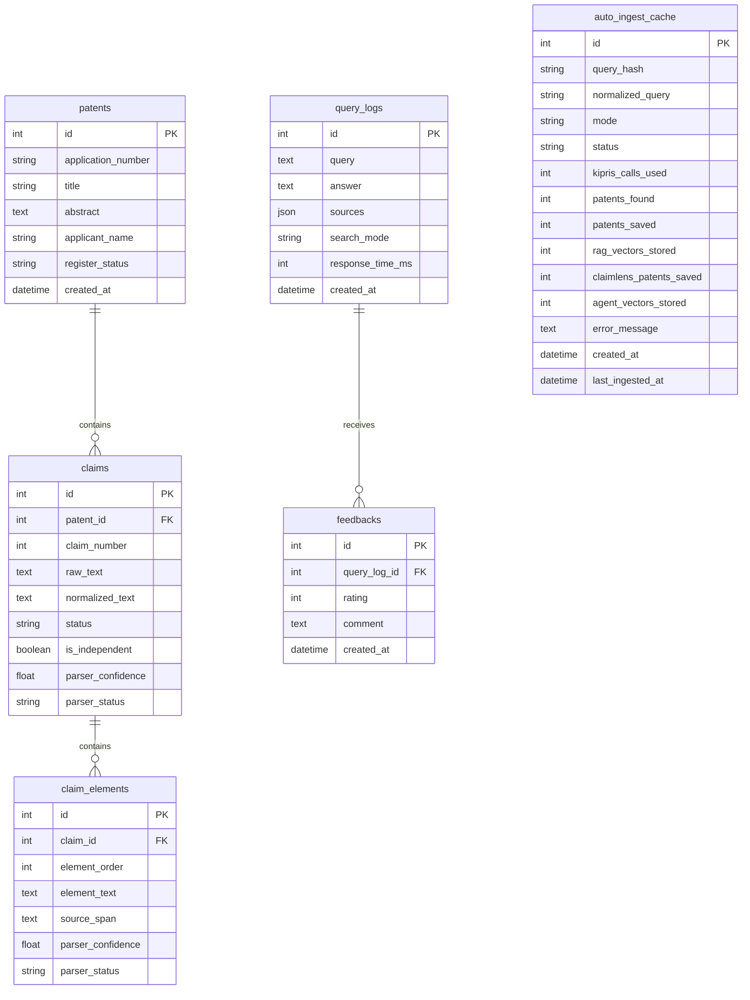
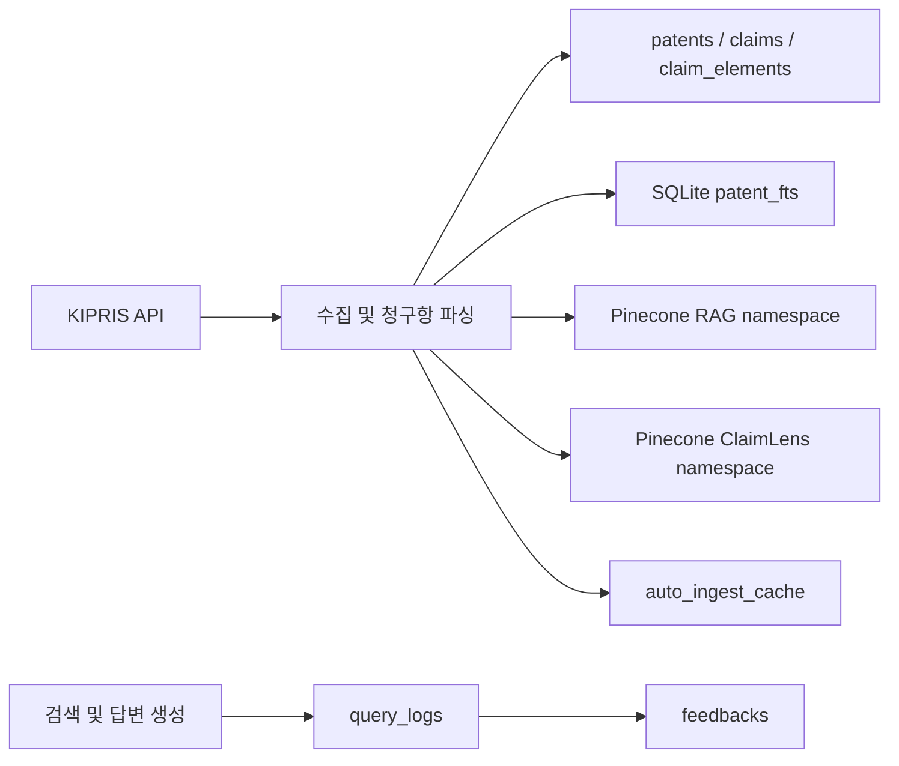

# TechDocs 데이터 저장소 설계

이 문서는 현재 코드에 구현된 데이터 구조를 설명하는 AS-IS 설계서입니다. 목표 구조를 제안하는 문서가 아니며, 변경 시 SQLAlchemy 모델·저장 로직·벡터 metadata와 함께 갱신합니다.

## 저장소 구성

| 저장소 | 용도 | 기준 코드 |
| --- | --- | --- |
| PostgreSQL 또는 SQLite | 특허, 청구항, 분석 구성요소, 검색 기록, 피드백, 자동 수집 기록 | `backend/app/models/`, `backend/app/db/database.py` |
| SQLite FTS5 | 로컬 SQLite 환경의 특허 청크 키워드 검색 | `backend/app/db/database.py`, `backend/app/ingestion/pipeline.py` |
| Pinecone `techdocs-rag` namespace | 자연어 RAG 검색용 특허 청크 벡터 | `backend/app/core/vectorstore.py` |
| Pinecone `claimlens-agent` namespace | 특허 초록, 독립 청구항 및 청구항 구성요소 벡터 | `backend/app/core/claimlens/vector_search.py` |

저장소 이름은 기본값이며 `DATABASE_URL`, `PINECONE_INDEX_NAME`, `RAG_NAMESPACE`, `AGENT_NAMESPACE` 환경변수로 변경할 수 있습니다.

## 관계형 데이터 구조

### `patents`

ClaimLens 분석에 사용하는 특허 기본 정보입니다.

| 필드 | 타입 | 필수 | 설명 |
| --- | --- | --- | --- |
| `id` | Integer | 예 | 기본 키 |
| `application_number` | String(32) | 예 | 정규화된 출원번호 |
| `title` | String(500) | 예 | 발명의 명칭 |
| `abstract` | Text | 아니요 | 특허 초록 |
| `applicant_name` | String(300) | 아니요 | 출원인 |
| `register_status` | String(50) | 아니요 | 등록 상태 |
| `created_at` | DateTime(timezone) | 아니요 | 생성 시각 |

현재 `application_number`에 고유 제약이 없으므로 저장 로직에서 기존 행을 먼저 조회하여 중복을 방지합니다.

### `claims`

특허별로 파싱한 청구항입니다.

| 필드 | 타입 | 필수 | 설명 |
| --- | --- | --- | --- |
| `id` | Integer | 예 | 기본 키 |
| `patent_id` | Integer | 예 | `patents.id` 외래 키 |
| `claim_number` | Integer | 예 | 특허 내부 청구항 번호 |
| `raw_text` | Text | 예 | 원본 청구항 |
| `normalized_text` | Text | 예 | 검색·비교용 정규화 청구항 |
| `status` | String(30) | 예 | 청구항 상태 |
| `is_independent` | Boolean | 아니요 | 독립항 여부 |
| `parser_confidence` | Float | 아니요 | 파서 신뢰도 |
| `parser_status` | String(50) | 아니요 | 파싱 상태 |

### `claim_elements`

청구항을 구성요소 단위로 분해한 결과입니다.

| 필드 | 타입 | 필수 | 설명 |
| --- | --- | --- | --- |
| `id` | Integer | 예 | 기본 키 |
| `claim_id` | Integer | 예 | `claims.id` 외래 키 |
| `element_order` | Integer | 예 | 청구항 내부 구성요소 순서 |
| `element_text` | Text | 예 | 구성요소 내용 |
| `source_span` | Text | 아니요 | 원문에서 대응하는 범위 |
| `parser_confidence` | Float | 아니요 | 파서 신뢰도 |
| `parser_status` | String(50) | 아니요 | 파싱 상태 |

### `query_logs`와 `feedbacks`

검색 답변과 사용자 평가를 연결합니다. `feedbacks.query_log_id`에는 DB 수준 `ON DELETE CASCADE`가 있고, ORM 관계에도 `delete-orphan` cascade가 설정되어 있습니다.

- `query_logs.sources`는 검색 시점의 출처 배열을 JSON으로 저장합니다.
- `query_logs.search_mode` 기본값은 `hybrid`입니다.
- `feedbacks.rating`은 현재 API 기준 `1` 또는 `-1`을 의미하지만 DB 제약은 없습니다.
- 하나의 검색 기록에 여러 피드백 행을 저장할 수 있습니다.

### `auto_ingest_cache`

동일 질의의 반복 수집을 줄이고 KIPRIS 호출량과 저장 결과를 기록합니다.

- `query_hash`와 `mode`에는 각각 일반 인덱스가 있습니다.
- `mode`는 현재 `rag` 또는 `claimlens` 흐름에서 사용합니다.
- 캐시 조회는 질의 hash, mode, TTL, 성공 상태 및 저장 건수를 함께 확인합니다.
- 일·월 KIPRIS 사용량은 `last_ingested_at` 이후의 `kipris_calls_used` 합계로 계산합니다.

## SQLite FTS5

SQLite 사용 시 애플리케이션 시작 과정에서 `patent_fts` 가상 테이블이 없을 때만 생성됩니다.

| 필드 | 설명 |
| --- | --- |
| `application_number` | 특허 출원번호 |
| `title` | 발명의 명칭 |
| `abstract` | 특허 초록 |
| `applicant_name` | 출원인 |
| `register_status` | 등록 상태 |
| `application_date` | 출원일 |
| `ipc_number` | IPC 분류 |
| `page_content` | 한국어 토큰화가 적용된 검색 대상 청크 |

한 특허가 여러 청크 행을 가질 수 있습니다. 수동 ingestion은 같은 출원번호의 기존 행을 삭제한 뒤 새 청크를 삽입합니다. PostgreSQL 환경에서는 이 FTS5 경로를 사용하지 않습니다.

## Pinecone 벡터 구조

### RAG namespace

- 특허 문서를 청크로 나눠 `techdocs-rag` namespace에 저장합니다.
- metadata에는 출원번호, 발명의 명칭, 출원인, IPC, 출원일, 등록 상태 및 출처 등 검색 결과 표시에 필요한 정보가 포함됩니다. 초록은 임베딩 대상 본문에 포함됩니다.
- 일반 검색과 similarity 검색은 이 namespace를 사용합니다.

### ClaimLens namespace

`claimlens-agent` namespace에는 다음 ID 형식으로 벡터를 저장합니다.

| 문서 종류 | ID 형식 | 주요 metadata |
| --- | --- | --- |
| 특허 초록 | `patent:{patent_id}:abstract` | `patent_id`, `application_number`, `title`, `text_type` |
| 독립 청구항 | `claim:{claim_id}` | `patent_id`, `claim_id`, `claim_number`, parser 정보 |
| 청구항 구성요소 | `claim_element:{element_id}` | `patent_id`, `claim_id`, `claim_element_id`, 순서, parser 정보 |

벡터 검색 결과의 ID와 metadata를 이용하여 관계형 DB의 원문 특허·청구항·구성요소를 다시 조회합니다. 따라서 관계형 행과 Pinecone metadata의 ID 정합성을 함께 유지해야 합니다.

## 저장 흐름

수동 ingestion은 RAG 벡터와 ClaimLens 관계형 데이터·벡터를 모두 저장합니다. 자동 수집은 실행 mode와 제한 설정에 따라 RAG 또는 ClaimLens 저장 경로를 선택하고 결과를 `auto_ingest_cache`에 기록합니다.

## 초기화와 트랜잭션

- 애플리케이션 시작 시 `Base.metadata.create_all()`로 없는 테이블을 생성합니다.
- 현재 Alembic 등 별도 스키마 마이그레이션 체계는 없습니다.
- HTTP 요청은 `get_db()`가 세션을 열고 종료 시 닫습니다. commit과 rollback은 쓰기 작업이 명시적으로 처리합니다.
- 요청 밖 저장은 `session_scope()` 또는 명시적 `SessionLocal()` 범위를 사용합니다.
- ClaimLens ingestion은 특허 단위로 commit하고 실패한 특허는 rollback한 뒤 다음 특허를 계속 처리합니다.

## 변경 시 확인 사항

- 테이블이나 필드를 바꾸면 SQLAlchemy 모델, 저장·조회 코드, API 타입과 이 문서를 함께 수정합니다.
- `patents → claims → claim_elements` 관계와 Pinecone metadata ID가 일치하는지 확인합니다.
- 삭제 규칙을 추가하기 전 관계형 DB와 Pinecone 벡터의 정리 순서를 정의합니다.
- unique, check, cascade 또는 index 제약을 추가할 때 기존 데이터 충돌 여부를 먼저 확인합니다.
- 운영 스키마 변경 전에는 재현 가능한 마이그레이션과 rollback 절차를 별도로 마련합니다.
