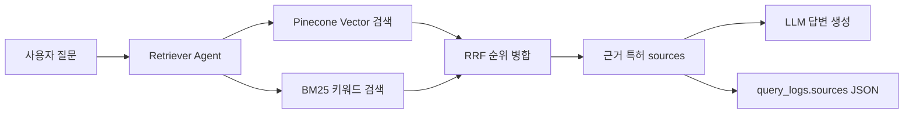
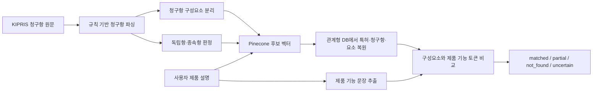
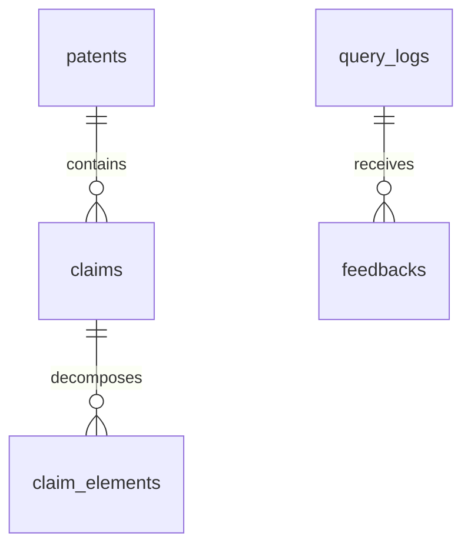
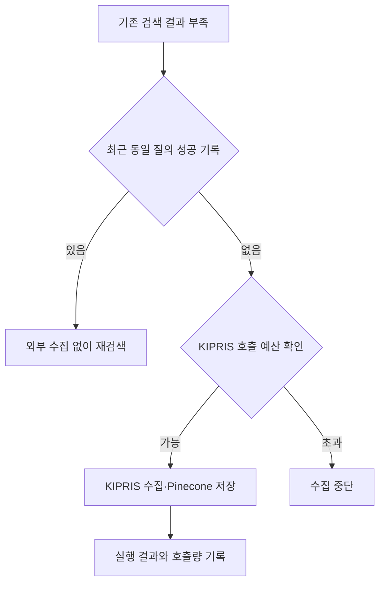

# TechDocs DB 컬럼 검토와 검색 흐름 이해

- 검토 기준일: 2026년 8월 12일
- 목적: DB 컬럼의 실제 사용처를 설명하고, 일반 RAG 검색과 ClaimLens 분석을 구분하여 향후 리팩토링 판단 기준을 제공합니다.
- 범위: 현재 SQLAlchemy 모델, 수집 파이프라인, RAG 검색, ClaimLens 파서 및 자동 수집 구현의 AS-IS 분석입니다.

## 먼저 이해할 두 가지 서비스 흐름

TechDocs의 일반 검색과 ClaimLens는 같은 Pinecone index를 사용하지만 namespace, 데이터 단위 및 결과 생성 방식이 다릅니다.

| 구분 | 일반 RAG 검색 | ClaimLens 분석 |
| --- | --- | --- |
| 사용자 입력 | 특허에 관한 자연어 질문 | 제품 또는 기술 설명 |
| 주요 목적 | 관련 특허 문서를 찾아 근거 기반 답변 생성 | 제품 기능과 특허 청구항 구성요소 비교 |
| Pinecone namespace | `techdocs-rag` | `claimlens-agent` |
| 검색 대상 | 특허 문서 청크 | 특허 초록, 독립항, 청구항 구성요소 |
| 후보 검색 | Vector 또는 BM25 + Vector Hybrid | Vector 검색 후 규칙 기반 재정렬 |
| 최종 처리 | 검색 문서를 LLM context로 전달해 답변 생성 | 제품 기능과 청구항 요소의 토큰 겹침을 계산 |
| DB 기록 | `query_logs.sources`에 근거 문서 스냅샷 저장 | `patents`, `claims`, `claim_elements`에서 원문 복원 |

### 일반 RAG 검색

- Vector 검색은 표현이 달라도 의미가 비슷한 문서를 찾습니다.
- BM25는 질문과 같은 단어가 포함된 문서를 찾습니다.
- Hybrid 검색은 두 검색 결과의 순위를 RRF로 합칩니다.
- Agent는 별도의 검색 알고리즘이 아니라 검색, 결과 부족 판단, 자동 수집, 재검색 및 답변 생성 순서를 조정합니다.
- `query_logs.sources`는 ClaimLens 청구항이 아니라 일반 RAG 답변에 사용된 근거 특허 문서 목록입니다.

### ClaimLens 분석

ClaimLens는 `특허 → 종속항 → 조사 제거 단어`만 비교하는 구조가 아닙니다.

1. 특허에는 여러 청구항이 있습니다.
2. 다른 청구항을 참조하지 않으면 독립항, 참조하면 종속항으로 판정합니다.
3. 활성 독립항 전체와 활성 청구항의 구성요소를 Pinecone에 저장합니다.
4. 제품 설명과 의미가 가까운 특허·청구항·구성요소 후보를 Vector 검색으로 찾습니다.
5. 후보의 전체 청구항 구성요소를 관계형 DB에서 다시 읽습니다.
6. 각 `element_text`와 제품 기능 문장의 일반 단어 토큰 겹침을 계산해 비교 상태를 만듭니다.

현재 청구항 분해는 AI가 아니라 정규식과 문자열 규칙을 사용합니다. 파서에는 LLM 보조 확장점이 있지만 실제 수집 호출에서는 LLM parser를 전달하지 않습니다. 조사 제거에 가까운 처리는 일반 RAG의 한국어 BM25 토큰화에 있고, ClaimLens 구성요소 파서는 주로 `상기`, `및` 같은 앞쪽 연결 표현을 정리합니다.

## 관계형 데이터 구조

독립항은 별도 테이블이 아니라 `claims.is_independent`로 표현되는 청구항의 한 종류입니다. 현재 파서는 종속항이 참조하는 청구항 번호를 계산하지만 DB에는 저장하지 않습니다.

## 컬럼 최종 판단표

| 테이블·컬럼 | 현재 사용처 | 판단 | 개선 방향 |
| --- | --- | --- | --- |
| `claims.raw_text` | KIPRIS 청구항 원문 보존 및 검색 결과 복원 | 유지 | 원문 보존 목적과 보존 기간을 명시 |
| `claims.normalized_text` | 독립항 임베딩과 비교용 정규화 문장 | 유지 | 정규화 규칙 변경에 대비해 version 검토 |
| `claims.status` | 본문이 `삭제`인 청구항을 파싱·검색에서 제외 | 유지 | `claim_status`처럼 의미를 명확히 하고 `active/deleted` 제약 추가 |
| `claims.is_independent` | 독립항 Vector 적재와 대시보드 통계 | 유지 | 종속항 참조 관계를 별도 컬럼 또는 테이블로 저장 검토 |
| `claims.parser_confidence` | 저장, Pinecone metadata, 후보 응답 | 조건부 유지 | 품질 게이트에 사용하거나 미사용이면 제거 검토 |
| `claims.parser_status` | 파싱 결과 상태 저장과 후보 응답 | 조건부 유지 | `uncertain/failed` 재검수 정책이 없으면 제거 검토 |
| `claim_elements.element_order` | 원래 순서 복원과 ClaimLens 비교표 | 유지 | `(claim_id, element_order)` 고유 제약 검토 |
| `claim_elements.element_text` | 구성요소 Vector 적재와 제품 기능 비교 | 유지 | 파서 회귀 테스트 강화 |
| `claim_elements.source_span` | 원문 대응 문자열 보존 | 조건부 유지 | 원문 근거 표시를 구현하거나 미사용이면 제거 검토 |
| `claim_elements.parser_confidence` | 요소별 파싱 품질 기록 | 조건부 유지 | 청구항 수준 값과 중복 여부 및 활용 정책 결정 |
| `claim_elements.parser_status` | 요소별 `parsed/uncertain` 기록 | 조건부 유지 | 낮은 품질 요소의 제외·재처리 정책 결정 |
| `query_logs.sources` | 일반 RAG 답변 근거 특허 스냅샷 | 유지 | `full_content` 저장 필요성과 보존 기간 검토 |
| `query_logs.response_time_ms` | 요청 시작부터 최종 답변 생성까지의 시간 | 유지 | 검색·수집·LLM 시간을 분리 측정할지 검토 |
| `auto_ingest_cache` 전체 | 최근 수집 확인, KIPRIS 호출량, 실행 결과와 오류 기록 | 재설계 | `auto_ingest_runs`로 의미를 명확히 하거나 캐시·실행이력·비용 책임 분리 |
| SQLite `patent_fts` | 로컬 환경의 BM25 키워드 검색 | 조건부 유지 | PostgreSQL 운영 검색과 공통 `chunk_id` 및 검색 방식을 정렬 |

## 파싱 품질 컬럼의 현재 기준

`parser_confidence`는 모델이 계산한 확률이 아니라 코드에 고정된 규칙 점수입니다.

| 상황 | 점수 또는 상태 |
| --- | --- |
| 삭제된 청구항 | `0.95`, `skipped` |
| 원문 포함 여부를 검증한 LLM 분해 | `0.85`, `parsed` |
| 규칙으로 여러 요소 분리 | 기본 `0.75`, `parsed` |
| 너무 긴 요소 | 최대 `0.60`, `uncertain` |
| 하나의 요소로만 인식 | `0.55`, `uncertain` |
| 분해 fallback | `0.50`, `uncertain` |
| 요소 없음 | `0.00`, `failed` |

청구항 전체 점수는 구성요소 점수의 최솟값입니다. 현재 운영 수집은 LLM parser를 사용하지 않으므로 `0.85` 경로는 실행되지 않습니다. 또한 이 값들은 저장·응답에는 포함되지만 낮은 점수의 후보 제외, 자동 재파싱 또는 사람 검수에 연결되지 않습니다.

`source_span`은 정리된 `element_text`가 청구항 원문의 어느 문자열에서 나왔는지 확인하려는 값입니다. 현재는 DB에서 읽기만 하고 화면 근거 표시나 비교 로직에는 사용하지 않습니다. 이름과 달리 시작·끝 위치가 아닌 원문 문자열이므로 유지한다면 `source_text`로 바꾸거나 실제 `source_start/source_end`를 저장하는 방안을 검토합니다.

## `auto_ingest_cache`가 필요한 이유와 문제

검색 결과가 부족할 때 동일한 질문마다 KIPRIS 검색, 임베딩 생성 및 Pinecone 저장을 반복하지 않기 위해 최근 성공 기록을 확인합니다. 동시에 일·월 KIPRIS 호출 횟수도 이 테이블의 합계로 계산합니다.

현재 한 테이블이 다음 책임을 함께 가집니다.

- 최근 수집 여부를 판단하는 캐시
- 수집 실행 성공·실패 이력
- KIPRIS 일·월 호출량 집계
- 관계형 DB와 Pinecone 저장 건수 기록

따라서 이름만 보고 이해하기 어렵습니다. 작은 서비스라면 테이블을 유지하면서 `auto_ingest_runs`로 이름과 상태 의미를 명확히 할 수 있습니다. 운영 감사와 정확한 동시 실행 제어가 필요해지면 실행 이력, 캐시 상태 및 API 사용량을 분리합니다.

## 우선 개선 과제

### 1. 동작을 바꾸기 전 명확히 할 것

- ClaimLens가 독립항만 비교할지, 종속항까지 권리 관계를 따라 비교할지 제품 기준을 정합니다.
- 파싱 품질 점수를 실제 후보 제외·재처리·사람 검수에 사용할지 정합니다.
- `source_span`을 원문 근거 표시 기능에 사용할지 정합니다.
- `query_logs.sources.full_content`와 AI 답변의 보존 목적 및 기간을 정합니다.
- 자동 수집 기록을 단순 데모 캐시로 볼지 운영 실행 이력으로 볼지 정합니다.

### 2. 안전한 DB 개선

- 실제 운영 PostgreSQL의 컬럼, 제약, 인덱스 및 데이터 분포를 읽기 전용으로 점검합니다.
- Alembic baseline을 만든 뒤 작은 migration으로 변경합니다.
- `patents.application_number`에 고유 제약을 검토합니다.
- `(patent_id, claim_number)`, `(claim_id, element_order)` 고유 제약을 검토합니다.
- FK index와 특허·청구항 삭제 cascade를 검토합니다.
- `status`, `mode`, `rating`에 허용값 제약을 추가합니다.
- 관계형 DB, SQLite FTS 및 Pinecone이 공유할 안정적인 `chunk_id`를 정의합니다.

### 3. 검색·분석 개선

- 스트리밍 검색의 LLM 중복 답변 생성을 제거하고 단계별 응답시간을 측정합니다.
- 파서의 `parser_method`, `parser_version` 및 종속항 참조 관계 저장 여부를 결정합니다.
- ClaimLens 토큰 겹침 비교의 정확도를 평가할 golden dataset을 마련합니다.
- SQLite와 PostgreSQL 환경에서 Hybrid 검색 결과가 다르게 동작하는 범위를 문서화하고 통일합니다.

## 다시 이해할 때의 권장 순서

1. RAG에서 문서 청크, Vector 검색, BM25 및 RRF가 각각 무엇인지 이해합니다.
2. Agent가 검색 알고리즘이 아니라 흐름 제어자라는 점을 확인합니다.
3. 특허의 독립항, 종속항 및 청구항 구성요소 개념을 구분합니다.
4. ClaimLens의 후보 Vector 검색과 최종 토큰 비교가 서로 다른 단계임을 확인합니다.
5. 관계형 DB 원문과 Pinecone Vector ID가 어떻게 연결되는지 확인합니다.
6. 자동 수집이 데이터 부족을 어떻게 보완하고 왜 실행 기록을 남기는지 확인합니다.
7. 위 흐름을 이해한 뒤 각 컬럼을 유지·개선·삭제로 결정합니다.

이 순서를 먼저 이해하면 개별 컬럼을 외워서 판단하지 않고, 서비스 흐름에 필요한 데이터인지 근거를 가지고 판단할 수 있습니다.
