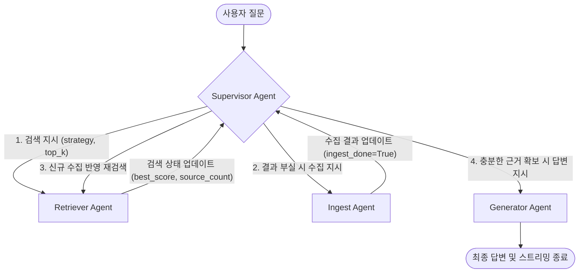

# TechDocs

> LangGraph 기반 Multi-Agent와 RAGAS 평가 기반 하이브리드 검색, 그리고 특허 침해 분석(ClaimLens)을 결합한 지능형 특허 검색 및 분석 플랫폼

TechDocs는 특허 문서를 키워드로만 찾기 어렵고 침해 여부를 직접 비교 분석하는 데에 많은 공수가 든다는 문제에서 출발한 프로젝트입니다. 

단순히 질문에 답하는 챗봇을 넘어, 데이터가 부족하면 에이전트가 자율적으로 판단해 외부 API(KIPRIS)에서 데이터를 수집·임베딩하여 다시 검색을 시도하는 **자율 순환형 Multi-Agent 아키텍처**로 설계되었습니다. 또한, 특허 청구항과 제품 명세를 비교하는 독자적인 침해 분석 모드(**ClaimLens**)를 제공합니다.

**Demo**: https://techdocs-app.vercel.app  
**API Docs**: https://techdocs-1v4q.onrender.com/docs

---

## Rights Notice & License (저작권 및 사용 제한 공지)

본 저장소의 모든 소스코드, 문서, 아키텍처 및 디자인에 대한 모든 권리와 저작권은 오직 **심우현(Paul Shim)**에게 있습니다.

*   **무단 복제, 배포, 2차 저작물 작성, 공유 및 상업적 사용을 절대 금지합니다.**
*   본 저장소는 포트폴리오 공개 및 기술 검토 목적으로만 제공되며, 어떠한 오픈소스 라이선스도 부여하지 않습니다.
*   사전 서면 서명 또는 합의 없이 본 소스코드를 무단 도용, 무단 전재, 복사, 유포 또는 상업적으로 이용하는 행위가 적발될 경우, **민·형사상의 강력한 법적 조치(법적 고소 및 피해 보상 청구)를 예외 없이 즉각 취할 것임을 강력히 경고합니다.**

Copyright (c) 2026 심우현 (Paul Shim). All rights reserved.

---

## 기획 배경 & 문제의식

특허 데이터는 기술 동향 분석과 아이디어 검증에 매우 중요하지만, 다음과 같은 기술적/비즈니스적 한계가 존재합니다.

1. **키워드 매칭의 한계**: 검색어와 완전히 일치하지 않으면 관련 특허를 놓치기 쉽습니다.
2. **할루시네이션(Hallucination) 리스크**: RAG 답변 생성 시 메타데이터 매핑이 누락되면 LLM이 임의로 특허 정보(출원인, 출원번호 등)를 지어내는 문제가 발생합니다.
3. **단절된 수집 흐름**: 로컬 DB에 검색하려는 기업의 최신 특허 데이터가 없을 때, 검색이 실패한 채로 끝나거나 사용자가 직접 수집 요청을 해야 하는 불편함이 있습니다.
4. **저사양 인프라 레이턴시 병목**: 매 검색 요청마다 DB에서 문서를 가져와 메모리 상에 BM25 인덱스를 매번 재빌드하여 Render.com 같은 저사양 배포 서버 환경에서 1분 이상의 응답 지연 및 OOM(Out Of Memory) 리스크가 있었습니다.

---

## 핵심 기능

| 기능 | 구현 내용 |
| --- | --- |
| **LangGraph 자율 수집 루프** | 검색 결과가 부실할 경우 `Supervisor`가 자율 판단하여 `IngestAgent`를 호출해 KIPRIS 데이터를 수집하고 자동으로 재검색을 진행합니다. |
| **RAGAS 기반 품질 최적화** | RAGAS 프레임워크 기반 튜닝으로 초기 대비 Faithfulness 점수를 약 2.5배(0.28 $\rightarrow$ 0.80) 향상시켰습니다. |
| **BM25 전역 메모리 캐싱** | 인덱스를 전역 변수 메모리 단에서 캐싱하여 후속 검색 레이턴시를 1분대에서 0.1초 내외로 수십 배 단축시켰습니다. |
| **특허 침해 분석 (ClaimLens)** | 청구항 구성요소 완비 법칙(All-Components Rule)에 기반해 제품 기능명세와 특허 청구항의 기술 오버랩을 비교 분석하여 침해 등급 레포트를 자동 생성합니다. |
| **하이브리드 검색 & RRF** | Pinecone Vector Search와 BM25를 수행한 뒤 Reciprocal Rank Fusion(RRF)으로 순위를 결합해 고정밀 검색을 보장합니다. |
| **SSE 스트리밍 & Timeline UI** | 백엔드 에이전트의 오케스트레이션 단계(KIPRIS 수집 중, 검색 중 등)와 답변 토큰을 SSE NDJSON 포맷으로 실시간 시각화합니다. |
| **피드백 루프 & 모니터링** | 사용자 피드백(좋아요/싫어요, 의견)을 SQLite에 로깅하고 부정 피드백을 모니터링할 수 있는 대시보드 API를 구현했습니다. |

---

## 시스템 구조

### LangGraph Multi-Agent 아키텍처

TechDocs는 상태(State)와 메시지 프로토콜을 공유하는 **Supervisor-Worker 기반 순환형 그래프** 구조를 띱니다.



*   **무한 루프 방지**: 수집-검색 간의 무한 루프를 방지하기 위해 State에 `ingest_done` 플래그를 두어 수집 태스크는 최초 1회만 동작하도록 예외 처리를 적용했습니다.

---

## 주요 구현 포인트

### 1. LangGraph 기반 자율 수집 및 피드백 루프
사용자가 검색한 문서가 DB에 부족한 경우, `SupervisorAgent`가 질문을 분석하여 `IngestAgent`에 제어권을 넘깁니다. `IngestAgent`는 KIPRIS Open API로부터 필요한 데이터를 수집·임베딩해 적재한 후 `RetrieverAgent`를 다시 실행하도록 오케스트레이션 흐름을 자율 조율합니다.

### 2. RAGAS 정량 평가 기반 품질 고도화
RAGAS를 통해 답변 신뢰성을 측정하며 파이프라인 품질을 고도화했습니다.
*   **Context 메타데이터 삽입**: 각 검색 청크 앞에 `[출원번호, 발명명칭, 출원인, 등록상태]` 헤더를 동적으로 삽입하여 LLM이 임의로 식별 정보를 날조하는 현상을 원천 차단했습니다.
*   **텍스트 스플리터 튜닝**: `RecursiveCharacterTextSplitter`를 이용하여 특허 문서의 단락 크기를 고려한 청크 크기(`chunk_size=800`, `chunk_overlap=100`)와 구분자 우선순위를 설정하여 핵심 문맥 유실을 최소화했습니다.
*   **품질 지표 개선**: 초기 성능(Faithfulness 0.28) 대비 최종 **Faithfulness 0.80**, **Precision 95.89%**를 달성했습니다.

### 3. BM25 인덱스 전역 캐싱을 통한 Latency 최적화
Render.com 무료 인프라의 CPU/메모리 한계를 극복하기 위해 `_bm25_cache` 전역 메모리 딕셔너리 캐싱을 도입했습니다.
*   검색 요청 때마다 Pinecone에서 전체 텍스트를 fetch해와 BM25 인덱스를 재빌드하던 병목을 해결하여, 후속 검색 응답 레이턴시를 **1분 이상 대기에서 0.1초 내외로 단축**했습니다.
*   새로운 특허가 Ingest되는 시점에만 캐시를 초기화(`clear_bm25_cache`)하는 정밀 무효화 설계로 데이터 정합성을 유지합니다.

### 4. ClaimLens (특허 침해 분석 모드)
청구항(Claim)의 개별 기술 구성요소들을 제품 기능 명세와 일대일로 비교 분석하는 **올-컴포넌트 룰(All-Components Rule) 알고리즘**을 개발했습니다.
*   `claim_parser.py`를 통해 독자적으로 청구항을 구조화하여 파싱하고, 각 구성요소별 매칭 강도를 `matched`, `partial`, `uncertain`, `not_found`로 식별하여 법률 검토 보고서 초안을 자동으로 구성합니다.

---

## API 요약

| Method | Endpoint | 설명 |
| --- | --- | --- |
| `GET` | `/health` | 서버 상태 확인 |
| `POST` | `/api/search/search` | 동기 RAG 검색. 답변과 출처를 한 번에 반환합니다. |
| `POST` | `/api/search/stream` | 스트리밍 RAG 검색. 에이전트 액션 및 답변 토큰을 실시간 NDJSON 스트림으로 반환합니다. |
| `POST` | `/api/search/similarity` | LLM 답변 없이 유사 문서만 반환합니다. |
| `POST` | `/api/ingest` | KIPRIS 특허 수집, 청킹, 임베딩, Pinecone 저장을 실행합니다. |
| `GET` | `/api/stats/` | Pinecone 인덱스와 회사별 벡터/특허 통계를 조회합니다. |
| `POST` | `/api/feedback` | 검색 답변에 대한 사용자 피드백을 저장합니다. |
| `GET` | `/api/feedback/stats` | 피드백 통계와 최근 부정 피드백을 조회합니다. |

---

## 기술 스택

| 영역 | 기술 |
| --- | --- |
| **Frontend** | Next.js App Router, TypeScript, React Query, Tailwind CSS, react-markdown |
| **Backend** | Python, FastAPI, Pydantic, slowapi (Rate Limiting) |
| **RAG / Agent** | LangGraph (Multi-Agent), LangChain, OpenAI Embeddings (`text-embedding-3-small`), GPT-4o-mini, Pinecone (Vector DB) |
| **Retrieval** | Pinecone Vector Search, BM25, RRF (Reciprocal Rank Fusion) |
| **Data** | KIPRIS Open API |
| **Database** | SQLite (Log 및 피드백 저장용, WAL mode) |
| **Infra / DevOps** | Docker, docker-compose, Vercel, Render, GitHub Actions (CI) |

---

## 프로젝트 구조

```text
TechDocs/
├── backend/
│   ├── app/
│   │   ├── agents/            # LangGraph 에이전트 및 노드 정의
│   │   │   ├── graph.py       # 워크플로우 그래프 컴파일 및 엣지 라우팅
│   │   │   ├── supervisor.py  # 다음 행동(SEARCH/INGEST/GENERATE) 판단 LLM 에이전트
│   │   │   ├── retriever.py   # 하이브리드 검색 및 품질 평가 에이전트
│   │   │   ├── ingest.py      # KIPRIS API 연동 및 자율 데이터 적재 에이전트
│   │   │   ├── generator.py   # 근거 기반 답변 생성 에이전트
│   │   │   └── protocol.py    # RAGAgentState 및 AgentMessage 규격 정의
│   │   ├── api/
│   │   │   ├── search.py      # 동기/스트리밍 검색 API
│   │   │   ├── ingest.py      # KIPRIS 수집 API
│   │   │   ├── stats.py       # Pinecone 통계 API
│   │   │   └── feedback.py    # 검색 피드백 API
│   │   ├── core/
│   │   │   ├── rag_pipeline.py
│   │   │   ├── hybrid_search.py # BM25 전역 캐싱 및 하이브리드 로직
│   │   │   ├── reranker.py
│   │   │   ├── vectorstore.py
│   │   │   ├── embeddings.py
│   │   │   ├── llm.py
│   │   │   └── prompts.py
│   │   ├── db/
│   │   │   └── database.py    # SQLite query_logs/feedbacks
│   │   ├── ingestion/
│   │   │   ├── kipris_client.py
│   │   │   ├── document_loader.py
│   │   │   ├── text_splitter.py
│   │   │   └── pipeline.py
│   │   └── models/
│   ├── eval/                  # RAGAS/검색 성능 평가 스크립트
│   ├── scripts/
│   ├── Dockerfile
│   └── requirements.txt
├── frontend/
│   ├── app/
│   │   ├── search/            # AI 검색 화면 (AgentTimeline 렌더링 포함)
│   │   ├── upload/            # 특허 수집 화면
│   │   ├── dashboard/         # 통계 대시보드
│   │   └── help/
│   ├── components/
│   ├── lib/api.ts             # API client + stream parser
│   └── types/
├── .github/workflows/ci.yml
├── docker-compose.yml
└── docker-compose.dev.yml
```

---

## 로컬 실행

### 요구사항

- Python 3.12 권장
- Node.js 20+
- OpenAI API key
- Pinecone API key/index
- KIPRIS API key

### Backend

```bash
cd backend
python -m venv .venv
source .venv/Scripts/activate # Windows: .venv\Scripts\activate
pip install -r requirements.txt
cp .env.example .env
uvicorn app.main:app --reload --port 8000
```

### Frontend

```bash
cd frontend
npm install
npm run dev
```

---

## 환경변수

```env
OPENAI_API_KEY=sk-...
OPENAI_MODEL=gpt-4o-mini
OPENAI_EMBEDDING_MODEL=text-embedding-3-small
PINECONE_API_KEY=pcsk_...
PINECONE_INDEX_NAME=techdocs-patents
KIPRIS_API_KEY=...
KIPRIS_BASE_URL=http://plus.kipris.or.kr/kipo-api/kipi
FRONTEND_URL=http://localhost:3000
```

---

## CI에서 확인하는 것

GitHub Actions의 `CI` workflow는 `main`, `develop` push와 `main`, `develop` 대상 PR에서 실행됩니다.

- backend job
  - Python 3.12 설정
  - `backend/requirements.txt` 설치
  - `app/main.py`, `app/config.py` 문법 검사
  - 핵심 모델 모듈(`app.models.patent`, `app.models.search`, `app.models.ingest`) 존재 여부 검사

- frontend job
  - Node.js 20 설정
  - `frontend/package-lock.json` 기준 `npm ci`
  - Next.js production build 실행

---

## 향후 고도화 방향

- **Query Rewriter 에이전트 도입**: 검색 실패 시 사용자의 원본 쿼리를 다양한 키워드 및 동의어로 재작성(Query Reformulation)해 내부 DB 검색 성공률(Recall)을 극대화하여 외부 API 호출 비용 최적화.
- **한국어 형태소 분석기(Kiwi) 도입**: 현재의 정규식 기반 토크나이저를 Kiwi 형태소 분석기로 대체하여 BM25 토큰 매칭 정확도 정교화.
- **피드백 데이터 분석 파이프라인**: 부정 피드백 로그를 기반으로 임베딩 가중치를 미세 조정하거나 실시간으로 Few-Shot 프롬프트를 교체하는 피드백 루프 자동화.
- **Reranker 프로덕션 최적화**: Flashrank 모델의 로딩 지연을 개선하고 서빙 비용을 고려한 별도 서빙 컨테이너 분리.
