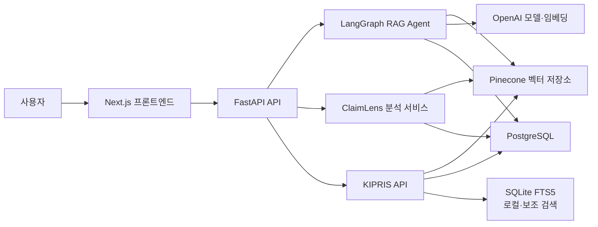

# TechDocs 시스템 아키텍처

- 수정일자: 2026-07-30 15:35 KST
- 작성자: Woohyun Sim
- 목적: 프론트엔드, 백엔드 API, AI Agent, 데이터 저장소와 외부 연동의 책임 및 요청 흐름을 설명합니다.

## 전체 구성

## 계층별 책임

- 프론트엔드:
  - 자연어 검색, 특허 수집, 대시보드, ClaimLens 화면을 제공합니다.
  - REST 응답은 React Query로 관리합니다.
  - RAG NDJSON과 ClaimLens SSE 스트림은 전용 Hook으로 관리합니다.
- API:
  - HTTP 요청 검증, 응답 형식, 오류 응답, 스트리밍 연결을 담당합니다.
  - 핵심 업무 흐름은 Service와 Agent에 위임합니다.
- Service:
  - 검색 스트림과 ClaimLens 분석 순서를 조정합니다.
  - 자동 수집, 재검색, 결과 생성의 실행 흐름을 관리합니다.
- AI Agent:
  - Supervisor가 다음 작업을 판단합니다.
  - Retriever가 특허 후보를 검색합니다.
  - Ingest가 부족한 데이터를 수집합니다.
  - Generator가 검색 근거 기반 답변을 생성합니다.
- Repository·Database:
  - QueryLog와 Feedback을 저장합니다.
  - ClaimLens 특허, 청구항, 구성요소와 자동 수집 상태를 저장합니다.
- 외부 저장소·API:
  - Pinecone은 특허·청구항 임베딩을 저장합니다.
  - PostgreSQL은 서비스 운영 데이터를 저장합니다.
  - KIPRIS는 특허 검색과 수집의 원천 API입니다.
  - OpenAI는 답변 생성과 임베딩을 담당합니다.

## 자연어 RAG 검색 흐름

- 사용자가 프론트엔드에서 자연어 질문을 입력합니다.
- 프론트엔드가 `/api/search/stream`으로 요청합니다.
- 백엔드가 검색 계획을 만들고 Agent 그래프를 실행합니다.
- Retriever가 관련 특허를 검색하고 결과 품질을 확인합니다.
- 결과가 부족하면 Ingest가 KIPRIS 데이터를 수집하고 다시 검색합니다.
- 충분한 근거가 확보되면 Generator가 답변과 출처를 생성합니다.
- 백엔드는 NDJSON으로 진행 상황과 답변 조각을 전달합니다.
- 검색 결과는 QueryLog에 저장되며 저장 실패가 사용자 응답을 중단시키지는 않습니다.

## ClaimLens 분석 흐름

- 사용자가 제품 설명과 선택적 기술 분야를 입력합니다.
- 프론트엔드가 `/api/claimlens/stream`으로 요청합니다.
- 제품 설명에서 검색 질의와 기능을 추출합니다.
- 관련 특허와 청구항 구성요소를 검색합니다.
- 검색 품질이 낮으면 KIPRIS 수집 후 재검색합니다.
- 제품 기능과 청구항 구성요소를 비교합니다.
- 프론트엔드는 SSE로 단계, 후보, 비교 결과, 최종 보고서를 순서대로 표시합니다.

## 데이터 흐름

- 특허 원문과 검색 청크:
  - Pinecone RAG namespace에 저장합니다.
  - SQLite 환경에서는 FTS5 보조 인덱스에도 저장합니다.
- ClaimLens 데이터:
  - 특허, 청구항, 구성요소는 PostgreSQL에 저장합니다.
  - 초록, 독립 청구항, 구성요소 임베딩은 ClaimLens Agent namespace에 저장합니다.
- 검색 기록:
  - 질문, 답변, 출처, 검색 방식, 응답 시간을 QueryLog에 저장합니다.
- 피드백:
  - Feedback이 QueryLog를 외래키로 참조합니다.

## 장애 및 경계

- 외부 API 오류:
  - KIPRIS, OpenAI, Pinecone 오류는 백엔드 로그에 기록합니다.
  - 일반 API는 공개용 오류 메시지를 반환합니다.
- 스트리밍 오류:
  - 연결 이후 발생한 오류는 NDJSON 또는 SSE `error` 이벤트로 전달합니다.
- 데이터 저장 오류:
  - QueryLog 저장 실패는 검색 응답과 분리합니다.
- 자동 수집 제한:
  - 호출 횟수, 검색 시도 횟수, 캐시 TTL을 환경변수로 관리합니다.
- 현재 인증:
  - 사용자 인증·인가 계층은 아직 구현되어 있지 않습니다.
