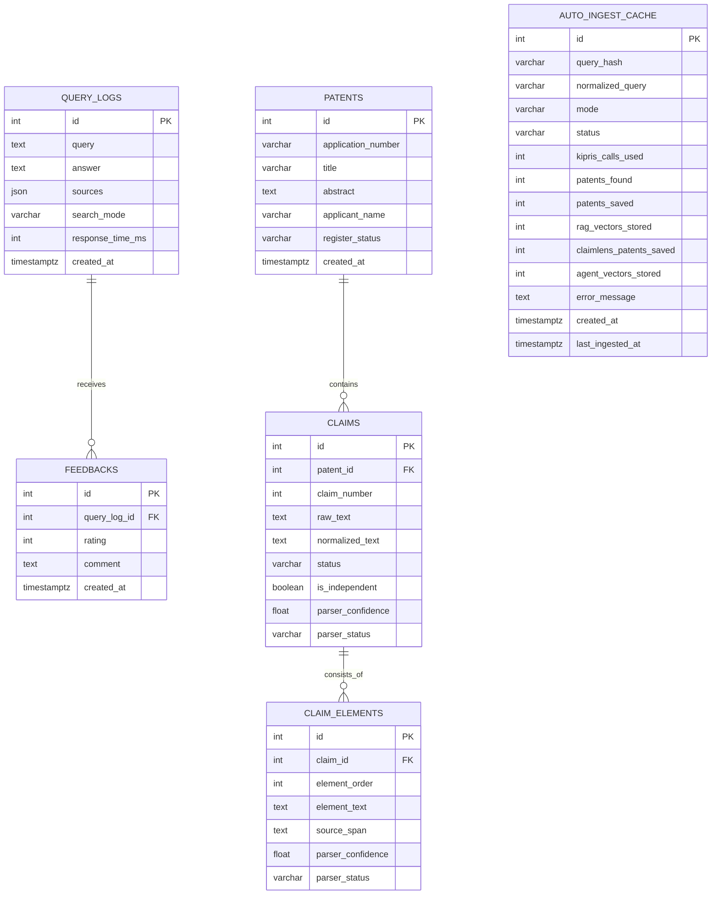

# TechDocs DB 설계서 및 ERD

- 수정일자: 2026-07-30 15:35 KST
- 작성자: Woohyun Sim
- 문서 목적: 현재 SQLAlchemy 모델과 실제 저장 흐름을 기준으로 관계형 데이터 구조와 외부 검색 저장소의 역할을 설명합니다.
- 기준 코드:
  - `backend/app/db/database.py`
  - `backend/app/models/feedback.py`
  - `backend/app/models/claimlens.py`
  - `backend/app/models/auto_ingest.py`
  - `backend/app/ingestion/pipeline.py`
  - `backend/app/ingestion/auto_ingest.py`

## 저장소 구성

- PostgreSQL:
  - 기본 운영 데이터베이스입니다.
  - QueryLog, Feedback, ClaimLens 분석 원천 데이터, 자동 수집 이력을 저장합니다.
- SQLite:
  - 로컬 또는 테스트 환경에서 사용할 수 있습니다.
  - 동일한 SQLAlchemy 모델 테이블을 생성합니다.
  - 추가로 `patent_fts` FTS5 가상 테이블을 생성해 키워드 검색을 보조합니다.
- Pinecone:
  - 관계형 DB가 아니라 특허 문서·청구항 임베딩을 저장하는 외부 벡터 저장소입니다.
  - RAG namespace와 ClaimLens Agent namespace를 분리합니다.
- DB 초기화:
  - 애플리케이션 시작 시 SQLAlchemy `create_all`로 모델 테이블을 준비합니다.
  - SQLite인 경우 기존 FTS5 테이블을 보존하면서 없을 때만 생성합니다.
  - 현재 별도 migration 도구나 migration 파일은 확인되지 않았습니다.

## ERD

- ERD 해석:
  - 하나의 QueryLog는 여러 Feedback를 가질 수 있습니다.
  - Feedback는 `query_logs.id`를 외래키로 참조합니다.
  - Feedback 삭제 시 연결된 QueryLog가 삭제되는 구조가 아니라, QueryLog 삭제 시 Feedback가 함께 삭제되는 `CASCADE`입니다.
  - 하나의 ClaimLens 특허는 여러 Claim을 가질 수 있습니다.
  - 하나의 Claim은 여러 ClaimElement를 가질 수 있습니다.
  - AutoIngestCache는 특정 QueryLog나 Patent에 직접 연결되지 않은 자동 수집 실행 기록입니다.

## 테이블 명세

### `query_logs`

- 역할:
  - 자연어 검색 질문, 생성 답변, 출처와 응답 성능을 기록합니다.
- 컬럼:

| Column | Type | Null | Key/Default | Description |
| --- | --- | --- | --- | --- |
| `id` | `INTEGER` | No | PK | 검색 기록 ID |
| `query` | `TEXT` | No | - | 사용자 질문 |
| `answer` | `TEXT` | No | - | 생성 답변 |
| `sources` | `JSON` | Yes | - | 검색 출처 목록 |
| `search_mode` | `VARCHAR(50)` | No | `hybrid` | 검색 방식 |
| `response_time_ms` | `INTEGER` | Yes | - | 응답 시간 |
| `created_at` | `TIMESTAMP WITH TIME ZONE` | No | `now()` | 생성 시각 |

- 저장 책임:
  - `app.repositories.query_log_repository.save_query_log`
- 호환성 주의:
  - 검색 응답은 QueryLog 저장 실패 시에도 중단되지 않습니다.
  - 이 경우 API 응답의 `query_log_id`가 `null`일 수 있습니다.

### `feedbacks`

- 역할:
  - QueryLog에 대한 사용자 평가와 의견을 기록합니다.
- 컬럼:

| Column | Type | Null | Key/Default | Description |
| --- | --- | --- | --- | --- |
| `id` | `INTEGER` | No | PK | 피드백 ID |
| `query_log_id` | `INTEGER` | No | FK | 대상 QueryLog |
| `rating` | `INTEGER` | No | - | 코드 주석상 `1` 또는 `-1` |
| `comment` | `TEXT` | Yes | - | 사용자 의견 |
| `created_at` | `TIMESTAMP WITH TIME ZONE` | No | `now()` | 생성 시각 |

- 관계:
  - `feedbacks.query_log_id` → `query_logs.id`
  - 외래키에 `ON DELETE CASCADE`가 설정되어 있습니다.
- 현재 제약:
  - 데이터베이스 CHECK constraint로 rating 범위를 강제하지 않습니다.
  - 중복 피드백 방지 unique constraint도 정의되어 있지 않습니다.

### `patents`

- 역할:
  - ClaimLens 분석에 필요한 특허 메타데이터를 저장합니다.
- 주의:
  - 테이블명은 `ClaimLensPatent` 모델의 클래스명과 달리 일반적인 `patents`입니다.
  - RAG 특허 원문 청크는 관계형 `patents` 테이블이 아니라 Pinecone과 SQLite FTS에 저장됩니다.
- 컬럼:

| Column | Type | Null | Key/Default | Description |
| --- | --- | --- | --- | --- |
| `id` | `INTEGER` | No | PK | 내부 특허 ID |
| `application_number` | `VARCHAR(32)` | No | - | 출원번호 |
| `title` | `VARCHAR(500)` | No | - | 발명의 명칭 |
| `abstract` | `TEXT` | Yes | - | 초록 |
| `applicant_name` | `VARCHAR(300)` | Yes | - | 출원인 |
| `register_status` | `VARCHAR(50)` | Yes | - | 등록 상태 |
| `created_at` | `TIMESTAMP WITH TIME ZONE` | Yes | - | 생성 시각 |

- 현재 제약:
  - `application_number`에 unique constraint가 모델에 선언되어 있지 않습니다.
  - 수집 파이프라인은 application number로 기존 특허를 조회해 갱신하는 애플리케이션 규칙을 사용합니다.

### `claims`

- 역할:
  - 특허 청구항 원문과 파싱 결과를 저장합니다.
- 컬럼:

| Column | Type | Null | Key/Default | Description |
| --- | --- | --- | --- | --- |
| `id` | `INTEGER` | No | PK | 청구항 ID |
| `patent_id` | `INTEGER` | No | FK | 소속 특허 |
| `claim_number` | `INTEGER` | No | - | 청구항 번호 |
| `raw_text` | `TEXT` | No | - | 원문 |
| `normalized_text` | `TEXT` | No | - | 정규화 텍스트 |
| `status` | `VARCHAR(30)` | No | - | 청구항 상태 |
| `is_independent` | `BOOLEAN` | Yes | - | 독립항 여부 |
| `parser_confidence` | `FLOAT` | Yes | - | 파서 신뢰도 |
| `parser_status` | `VARCHAR(50)` | Yes | - | 파싱 상태 |

- 관계:
  - `claims.patent_id` → `patents.id`
- 수집 시 동작:
  - 기존 특허의 청구항을 삭제하고 최신 파싱 결과를 다시 저장합니다.

### `claim_elements`

- 역할:
  - 청구항을 비교 가능한 기술 구성요소 단위로 저장합니다.
- 컬럼:

| Column | Type | Null | Key/Default | Description |
| --- | --- | --- | --- | --- |
| `id` | `INTEGER` | No | PK | 구성요소 ID |
| `claim_id` | `INTEGER` | No | FK | 소속 청구항 |
| `element_order` | `INTEGER` | No | - | 구성요소 순서 |
| `element_text` | `TEXT` | No | - | 구성요소 내용 |
| `source_span` | `TEXT` | Yes | - | 원문 위치 정보 |
| `parser_confidence` | `FLOAT` | Yes | - | 파서 신뢰도 |
| `parser_status` | `VARCHAR(50)` | Yes | - | 파싱 상태 |

- 관계:
  - `claim_elements.claim_id` → `claims.id`
- 수집 시 동작:
  - 기존 Claim의 구성요소를 삭제하고 최신 파싱 결과를 다시 저장합니다.

### `auto_ingest_cache`

- 역할:
  - 자동 수집 요청의 중복 방지, 호출량 제한, 결과와 실패 상태를 기록합니다.
- 컬럼:

| Column | Type | Null | Key/Default | Description |
| --- | --- | --- | --- | --- |
| `id` | `INTEGER` | No | PK | 자동 수집 기록 ID |
| `query_hash` | `VARCHAR(64)` | No | Index | 정규화 질의 해시 |
| `normalized_query` | `VARCHAR(500)` | No | - | 정규화된 질의 |
| `mode` | `VARCHAR(30)` | No | Index | RAG 또는 ClaimLens 모드 |
| `status` | `VARCHAR(30)` | No | - | 처리 상태 |
| `kipris_calls_used` | `INTEGER` | No | `0` | KIPRIS 호출 수 |
| `patents_found` | `INTEGER` | No | `0` | 발견 특허 수 |
| `patents_saved` | `INTEGER` | No | `0` | 저장 특허 수 |
| `rag_vectors_stored` | `INTEGER` | No | `0` | RAG 벡터 수 |
| `claimlens_patents_saved` | `INTEGER` | No | `0` | ClaimLens 저장 특허 수 |
| `agent_vectors_stored` | `INTEGER` | No | `0` | Agent 벡터 수 |
| `error_message` | `TEXT` | Yes | - | 실패 메시지 |
| `created_at` | `TIMESTAMP WITH TIME ZONE` | No | - | 실행 생성 시각 |
| `last_ingested_at` | `TIMESTAMP WITH TIME ZONE` | No | - | 마지막 수집 시각 |

- 인덱스:
  - `query_hash`
  - `mode`
- 관계:
  - 현재 모델상 다른 테이블에 대한 외래키가 없습니다.

## SQLite FTS5 보조 인덱스

- 테이블: `patent_fts`
- 목적:
  - SQLite 환경에서 특허 텍스트의 키워드 검색을 보조합니다.
- 컬럼:
  - `application_number`
  - `title`
  - `abstract`
  - `applicant_name`
  - `register_status`
  - `application_date`
  - `ipc_number`
  - `page_content`
- 동작:
  - 특허 청크가 적재될 때 동일 application number의 기존 FTS 행을 삭제합니다.
  - 토큰화된 텍스트를 다시 삽입합니다.
  - FTS5 `unicode61` tokenizer를 사용합니다.
- 성격:
  - 정규 테이블의 원본 데이터가 아니라 검색 보조 인덱스입니다.
  - PostgreSQL 운영 환경의 기본 저장 모델과 동일한 테이블로 취급하면 안 됩니다.

## 외부 벡터 저장소 모델

- RAG namespace:
  - 일반 특허 문서 청크와 메타데이터를 저장합니다.
- Agent namespace:
  - ClaimLens 특허 초록, 독립 청구항, 청구항 구성요소 임베딩을 저장합니다.
- 벡터 메타데이터 주요 값:
  - `application_number`
  - `title` 또는 `invention_title`
  - `patent_id`
  - `claim_id`
  - `claim_element_id`
  - `text_type`
  - `claim_number`
  - `element_order`
- 관계형 DB와의 연결:
  - Pinecone metadata의 `patent_id`, `claim_id`, `claim_element_id`가 관계형 데이터의 내부 ID를 가리킵니다.
  - 이 연결은 애플리케이션 규약이며 Pinecone이 외래키를 보장하지는 않습니다.

## 트랜잭션 및 데이터 갱신

- 요청 단위 DB 세션:
  - FastAPI `get_db`가 세션을 열고 요청 종료 후 닫습니다.
- 애플리케이션 작업 세션:
  - `session_scope`가 commit, rollback, close 수명주기를 관리합니다.
- QueryLog:
  - 검색 결과 생성 후 별도 Repository 세션에서 저장합니다.
  - 저장 실패는 로그로 기록하고 검색 결과는 계속 반환합니다.
- ClaimLens 수집:
  - 특허별로 기존 청구항·구성요소를 삭제한 뒤 최신 파싱 결과를 다시 저장합니다.
  - 해당 특허의 벡터 문서도 재구성합니다.
- 자동 수집 캐시:
  - 질의 해시와 모드로 중복 수집을 제어합니다.
  - 일일·월간 KIPRIS 호출량과 캐시 TTL은 환경변수로 조정합니다.

## 현재 확인된 DB 설계 리스크

- 마이그레이션:
  - 현재 `create_all` 중심이라 운영 스키마 변경 이력과 롤백 절차가 별도로 필요합니다.
- 자연키 중복:
  - `patents.application_number`에 DB unique constraint가 없어 동시 수집 시 중복 가능성을 검토해야 합니다.
- 청구항 정합성:
  - `claims`와 `claim_elements` 외래키는 있지만 cascade 삭제 옵션은 모델에 명시되어 있지 않습니다.
  - 애플리케이션 삭제 순서에 의존하므로 삭제 정책을 문서화해야 합니다.
- 피드백 품질:
  - `rating` 허용값이 DB와 Pydantic 양쪽에서 강제되지 않습니다.
- 관측성:
  - 자동 수집 기록은 있지만 QueryLog와 자동 수집 실행을 직접 연결하는 식별자가 없습니다.

## 변경 관리

- 스키마 변경 전 확인:
  - API 응답과 프론트엔드 타입 영향
  - 기존 데이터 backfill 필요성
  - 인덱스와 unique constraint 영향
  - 운영 DB 백업과 rollback 방법
- 스키마 변경 시 함께 갱신할 문서:
  - 이 문서의 ERD와 테이블 명세
  - [API 설계서](API.md)
  - [실행 환경 및 CI 문서](RUNTIME_ENVIRONMENT.md)
- 현재 문서는 코드 기반 현황 문서이며, 별도 migration 실행이나 DB 스키마 변경을 수행하지 않습니다.
