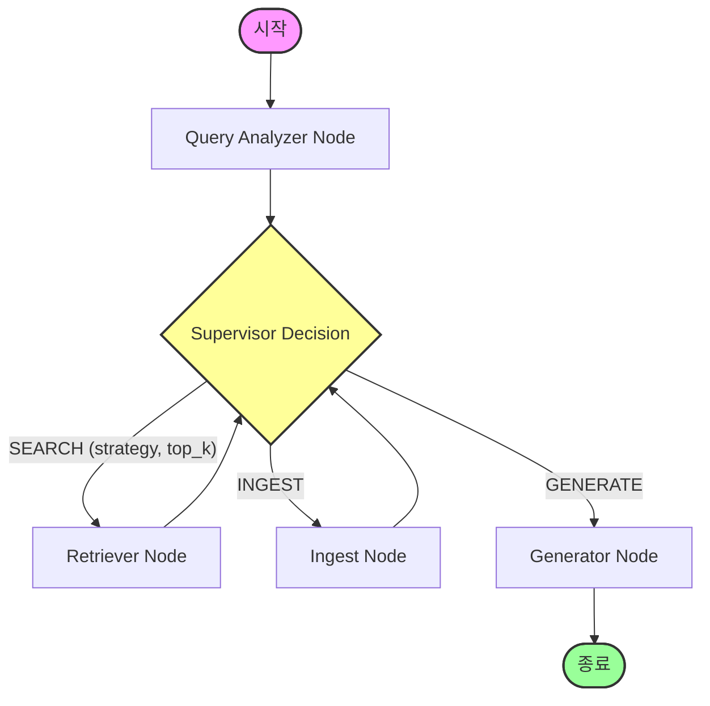

# TechDocs LangGraph 기반 Multi-Agent 리팩토링 계획

본 계획서는 현재 **FastAPI + asyncio의 수동 while 루프**로 동작하는 RAG 특허 검색의 멀티 에이전트 시스템을, 업계 표준인 **LangGraph 프레임워크 기반의 StateGraph 아키텍처**로 전환하여 시스템 안정성을 높이고 포트폴리오의 기술적 가치를 극대화하기 위한 상세 리팩토링 계획입니다.

---

## 1. 전환 목표

*   **수동 제어 루프의 표준화**: `while` 루프와 임시 분기문으로 제어되던 에이전트 흐름을 LangGraph의 `StateGraph`를 통해 정형화합니다.
*   **세션/상태 관리(Checkpointer) 도입**: DB 없이도 이전 탐색 상태를 메모리(`MemorySaver`)에 영속적으로 추적 및 백업하여 실무 수준의 복구성을 획득합니다.
*   **포트폴리오 경쟁력 극대화**: 이력서 및 면접에서 "최신 LangGraph 스택을 활용하여 순환형 에이전트(Cyclic Agent)를 프로덕션 레벨로 빌드한 경험"을 자신 있게 어필하도록 합니다.

---

## 2. 신규 아키텍처 설계

LangGraph는 **State(상태)**, **Nodes(노드/수행 작업)**, **Edges(엣지/분기 규칙)**의 세 가지 핵심 요소로 그래프 흐름을 제어합니다.

### 2-1. RAG 에이전트 상태 (State) 정의
에이전트들이 공통으로 보고 수정할 상태 보드(`RAGAgentState`)를 선언합니다.

```python
from typing import TypedDict, Annotated, Sequence
from langchain_core.messages import BaseMessage

class RAGAgentState(TypedDict):
    query: str                                # 최초 질문
    query_plan: dict | None                   # 검색 계획 정보
    sources: list[dict]                       # 현재까지 탐색된 특허 문서 목록
    best_score: float                         # 최고 관련도 점수
    matched_terms: list[str]                  # 겹치는 키워드
    quality_reason: str                       # 품질 평가 결과 사유
    ingest_done: bool                         # KIPRIS 자동 수집 완료 여부
    ingest_result: dict | None                # 수집된 수치 결과
    answer: str                               # 최종 생성 답변
    citation_valid: bool                      # 답변 출처 신뢰도 검증 결과
    history: list[dict]                       # 에이전트 행동 히스토리
    next_action: str                          # Supervisor가 지정한 다음 행동
```

### 2-2. 흐름도 (Mermaid Diagram)



---

## 3. 코드 전환 상세 매핑

리팩토링 과정에서 기존 에이전트 로직을 최대한 보존하며 LangGraph 구조로 부드럽게 이식합니다.

| 기존 구현 방식 | LangGraph 전환 방식 | 변경 위치 및 설명 |
| :--- | :--- | :--- |
| **`app/agents/protocol.py`** | **`RAGAgentState(TypedDict)`** | 데이터 구조를 LangGraph 전용 State로 변환합니다. |
| **`app/agents/supervisor.py`** | **`Conditional Edge (Router)`** | `SupervisorAgent.decide()`를 조건부 엣지 함수(`decide_next_node`)로 연동하여 LLM이 분기를 판단하도록 합니다. |
| **`app/agents/retriever.py`** | **`retriever_node (Node)`** | 검색 실행 후 결과를 State에 채워 넣는 독립 Node 함수로 래핑합니다. |
| **`app/agents/ingest.py`** | **`ingest_node (Node)`** | KIPRIS 수집 완료 후 `ingest_done=True` 및 수집 결과를 업데이트하는 Node 함수로 바꿉니다. |
| **`app/agents/generator.py`** | **`generator_node (Node)`** | 답변 생성, 중복 제거, 압축, citation 검증 후 `answer` 및 `citation_valid` 결과를 State에 갱신하고 종료를 알리는 Node 함수로 래핑합니다. |
| **`app/api/search.py`** | **`workflow.compile().astream()`** | 컴파일된 LangGraph 인스턴스의 비동기 스트림을 통해 실시간 단계별 이벤트를 SSE로 yield 하도록 깔끔하게 개편합니다. |

---

## 4. 리팩토링 3단계 진행 계획

실행에 1일 미만이 소요되도록 단계를 조밀하게 압축하여 안전하게 구현합니다.

### 4-1. [Step 1] 패키지 설치 및 State 정의 (소요: 1.5시간)
*   `backend/requirements.txt`에 `langgraph` 추가 및 설치
*   `backend/app/agents/protocol.py` 수정: `RAGAgentState` 클래스 정의 및 `AgentMessage` 구조 개편

### 4-2. [Step 2] Node 함수화 및 Graph 구성 (소요: 3시간)
*   `retriever.py`, `ingest.py`, `generator.py` 코드를 LangGraph Node 형식(`(state: RAGAgentState) -> dict`)으로 수정
*   `backend/app/agents/graph.py` 생성: `StateGraph` 빌드 및 노드 연결, `conditional_edges` 연동, `MemorySaver` 체크포인터 바인딩 및 컴파일 완료

### 4-3. [Step 3] API 라우터 연동 및 통합 테스트 (소요: 2.5시간)
*   `backend/app/api/search.py`가 컴파일된 LangGraph(`graph.astream()`)를 돌려가며 각 노드의 중간 결과와 스트리밍 답변을 방출하도록 개편
*   `backend/tests/` 내 단위 테스트 코드들을 LangGraph 실행 흐름에 맞추어 검증 및 전체 통과 달성

---

## 5. 면접관 질문 대비 말하기 스크립트

> **Q. RAG 검색에 굳이 LangGraph를 쓴 이유가 무엇인가요?**
> 
> **A.** "처음에는 `while` 루프와 `if-else` 분기만으로 에이전트 루프를 수동 구현했습니다. 하지만 에이전트들의 대화 이력이 쌓이고, 수집 실패 시 재시도(Retry)나 검토자 개입(Human-in-the-loop) 같은 복잡한 비즈니스 로직을 확장하려다 보니 코드의 스파게티화가 우려되었습니다.
> 이에 따라 에이전트의 Node(수행 역할)와 Edge(결정 흐름)를 명확히 분리하고 세션별 상태를 영속적으로 관리(Checkpointing)하기 위해, 업계 표준인 **LangGraph 프레임워크로 리팩토링**하여 확장성과 코드 유지보수성을 극대화했습니다."
